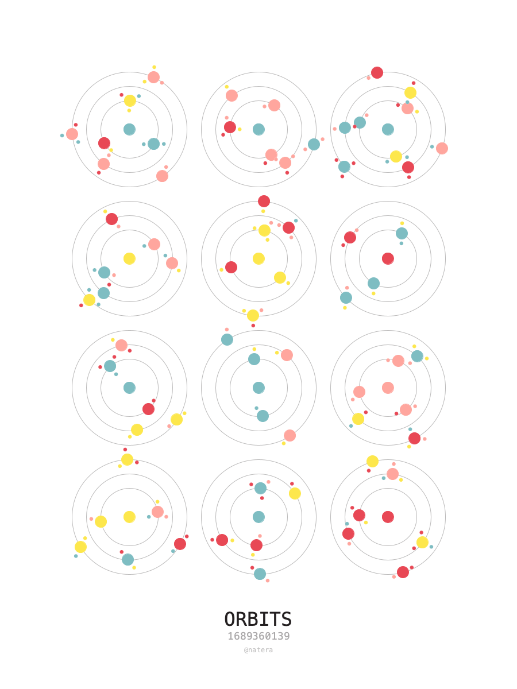

# Creative Coding

## 20230714_Orbits

[Code](20230714_orbits/orbits.py)

Every time the algorithm runs, a new set of orbits is generated. Each orbit can contain a random set of planets, and a random set of moons.

