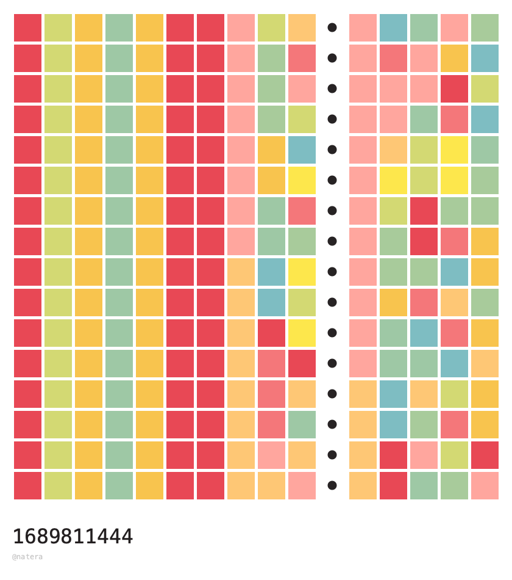
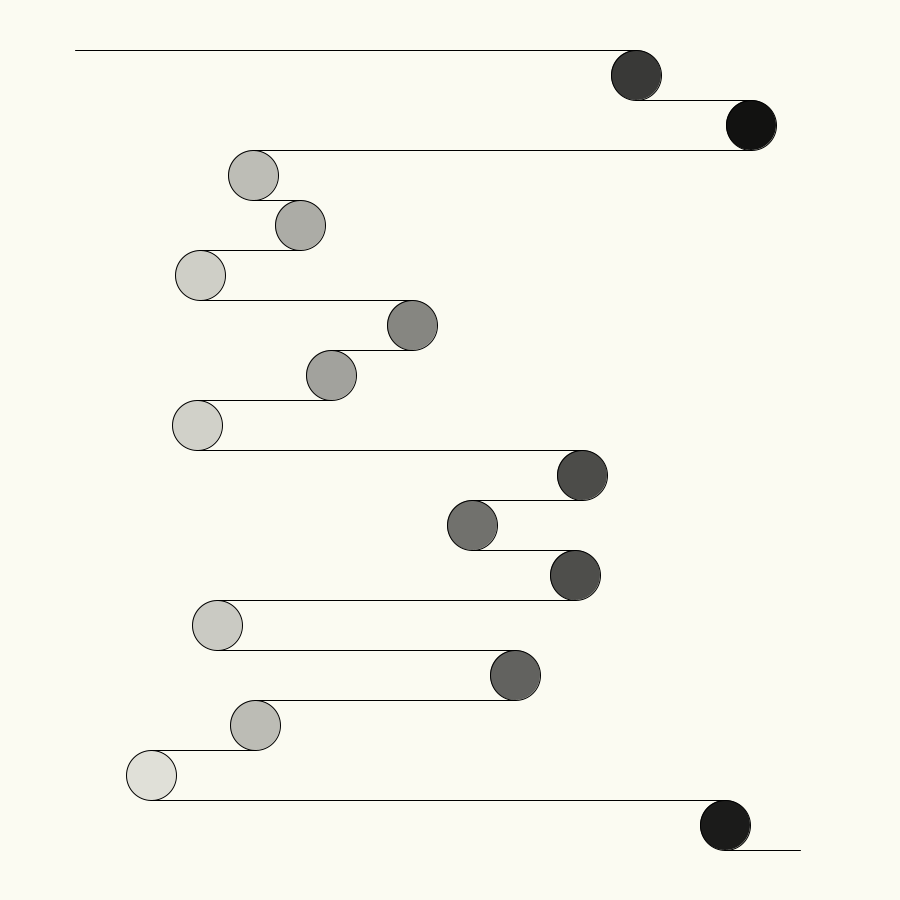
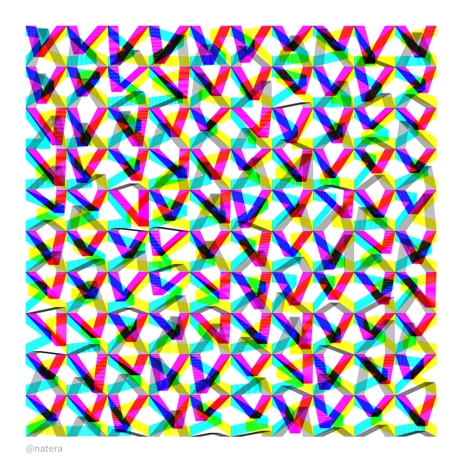
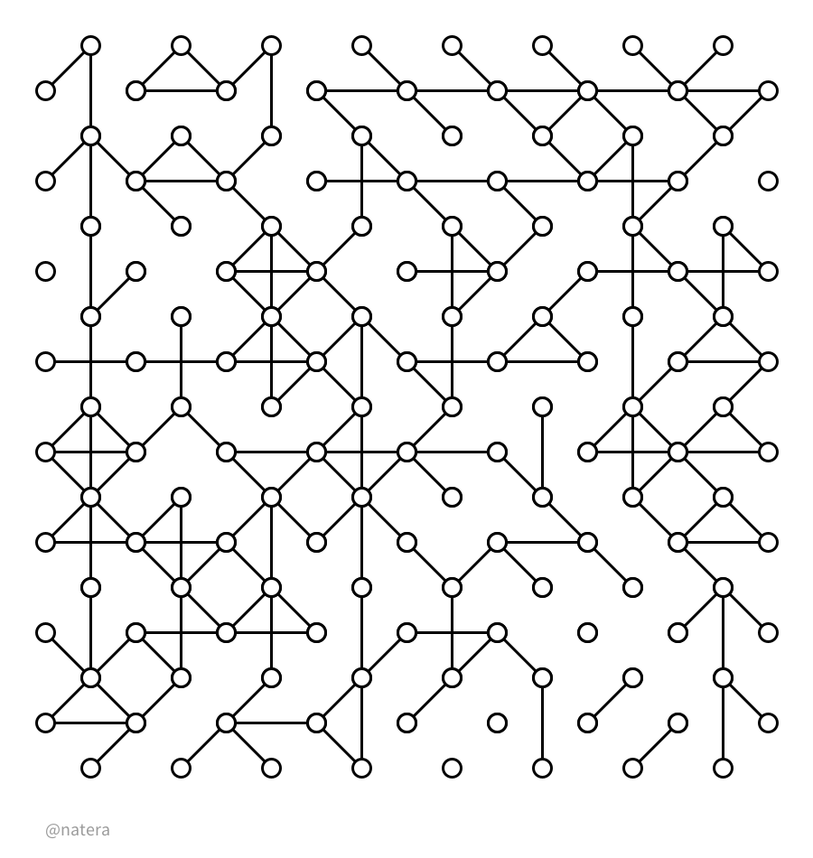

# Creative Coding

## 20230714_Orbits

[Code](20230714_orbits/orbits.py)

Every time the algorithm runs, a new set of orbits is generated. Each orbit can contain a random set of planets, and a random set of moons.

## 20230718_time

[Code](20230718_time/time.py)

Visualizing Unix time. The unix time is a date and time representation widley used in computing. It measures the time since the Unix epoch. This peaces are graphical representations of the Unix time values. Each time the script is run, it generates 16 time strips, the difference of time between each strip is randomized between 1 to 10 seconds. Then the colors are assigned based on the values of the time. The title of each image is the last time string that was captured.

## 20230802_tangents

[Code](20230802_tangents/tangents.py)

The algorithm creates tangent lines along the plot space. At the end of each line, a circle, touching the line, is created, and a new tangent line is draw. The algorithm repeats the process for multiple time, creating a sequence of lines and circles that is unique for each run. 

## 20230804_experiment

[Code](20230804_expermient/experiment_shape.py)

Visual experimentation with lines that repeats itself 20 times. The script uses CMYK colors to generate new paterns in every iteration.

## 20230922_lattice

[Code](20230922_lattice/lattice.py)
Nodes and edges to generate a lattice from a simple structure. The system can either link or not link two nodes.

